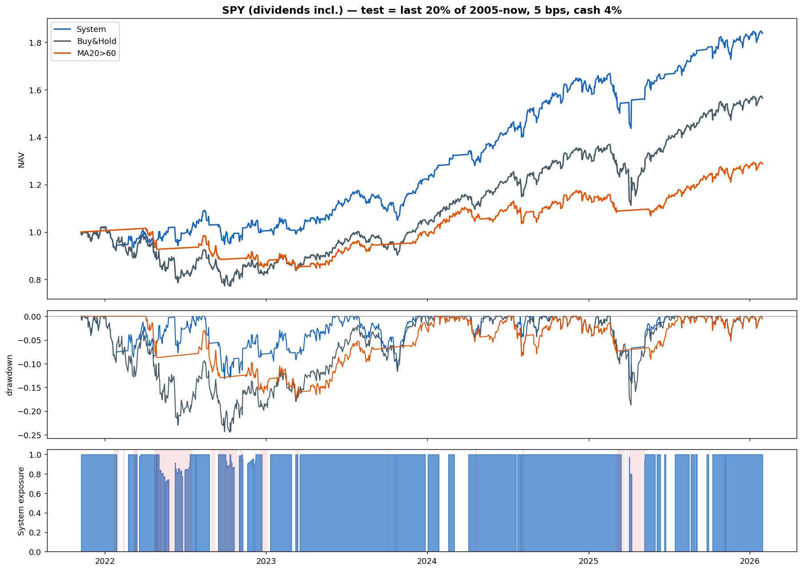
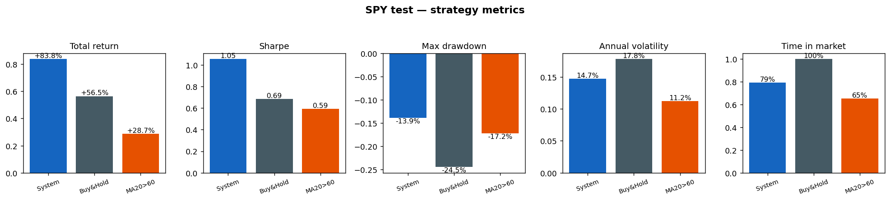

# Alpha Timing

A **regime-routed trading system**: a market-regime classifier routes each trading day to one of four regime-specialist return predictors, whose forecasts drive a cost-aware dual-threshold position rule with a volatility-target overlay.

```
                       ┌──────────────────────────────┐
 daily features ──────►│ regime nowcaster (RF)        │
 (trailing only)       │ Bull / Bear / Sideways /     │
                       │ Crisis                       │
                       └───────────────┬──────────────┘
                                       │ routes to
                       ┌───────────────▼──────────────┐
                       │ 4 regime specialists (GBT)   │
                       │ predict 5-day excess return  │
                       └───────────────┬──────────────┘
                                       │ ŷ
                       ┌───────────────▼──────────────┐
                       │ dual-threshold hysteresis    │
                       │ (defensive in Bear/Crisis)   │
                       │ + volatility targeting       │
                       └───────────────┬──────────────┘
                                       ▼
                              position ∈ [0, 1]
```

> Research / educational project. Not investment advice.

## How it works

- **Regime nowcaster** — a RandomForest classifies the current market regime from 16 trailing features (momentum, MA deviation, volatility, price position + VIX, rates, unemployment, yield curve). See the companion repo [regime-classifier](https://github.com/davidxu277/regime-classifier).
- **Regime specialists** — four gradient-boosting regressors, one per regime, each trained only on days of its regime, all predicting the same target: 5-day excess return over cash. Specialization comes from the data each expert sees, not from different objectives.
- **Decision layer** — dual-threshold hysteresis: enter only when the prediction clears an entry line, exit only when it falls below an exit line; the buffer between absorbs day-to-day prediction noise. The two threshold pairs are **regime-asymmetric**: in Bear/Crisis the system demands a strongly positive forecast to be long and exits on any negative one ("slow in, fast out"). A volatility-target overlay (25% annualized) scales exposure down when realized volatility spikes.
- **Causality** — every feature is trailing; at deployment the regime is always the classifier's prediction, never a label; positions decided at close *t* earn the return of *t*→*t+1*; 5 bps per position change; idle cash earns interest.

**Training chronology:** the nowcaster and specialists are trained on 35 US stocks using data before 2013 → the four threshold parameters are selected on 2013–2018 by Calmar ratio → everything after is out-of-sample.

## Results — SPY, Nov 2021 → 2026

Test protocol: SPY adjusted close (dividends included) from 2005, chronological split, **test = the last 20% (Nov 2021 → present)**; 5 bps costs, idle cash at 4%/yr. Nothing is tuned on SPY — the models come from the 35-stock universe, so this is a pure out-of-universe transfer test.

| Strategy | Total return | Sharpe | maxDD | Annual vol | Time in market |
|---|---|---|---|---|---|
| **System** | **+83.8%** | **1.05** | **−13.9%** | 14.7% | 79% |
| Buy & Hold | +56.5% | 0.69 | −24.5% | 17.8% | 100% |
| MA20>60 | +28.7% | 0.59 | −17.2% | 11.2% | 65% |





The bottom panel shows the system's exposure: through the 2022 bear market the nowcaster flags risk-off (red shading) and the system repeatedly steps into cash, then stays close to fully invested through the 2023–2025 recovery.

**Yearly attribution (System − Buy & Hold):**

| Year | System | Buy & Hold | Excess |
|---|---|---|---|
| **2022** | **−1.6%** | **−19.0%** | **+17.4pp** |
| 2023 | +21.7% | +26.0% | −4.3pp |
| 2024 | +30.1% | +25.3% | +4.8pp |
| 2025 | +14.0% | +18.2% | −4.2pp |

The edge is earned by sidestepping the 2022 bear market; in bull years the system roughly keeps pace. The system trades a small drag in bull markets for large protection in bear markets — which is exactly what a regime-aware allocator is for.

## Limitations

- The excess return is event-driven: it comes from correctly de-risking in bear markets. In strongly bullish windows with no drawdown to avoid, the system trails Buy & Hold on raw return (while keeping a higher Sharpe and much smaller drawdowns).
- Regime labels used for training are third-party (price/volatility-defined); single final test window; assumes daily close execution at 5 bps.

## Data

`stock_market_regimes_2000_2026.csv` (~35 MB, included): [Stock Market Regimes (2000–2026)](https://www.kaggle.com/datasets/mafaqbhatti/stock-market-regimes-20002026) by Muhammad Afaq Bhatti on Kaggle, Apache 2.0 — daily prices, regime labels and macro data for 39 US tickers. SPY adjusted prices are downloaded from Yahoo at runtime.

## Usage

```bash
pip install -r requirements.txt
python regime_trading.py
```

One command does everything: trains the nowcaster and specialists, selects the thresholds, runs the SPY test, prints the results table + yearly attribution, and saves the figures. The entire system lives in a single file, [regime_trading.py](regime_trading.py).

## Disclaimer

For research and educational purposes only. Not investment advice; backtest results are not evidence of future performance.
